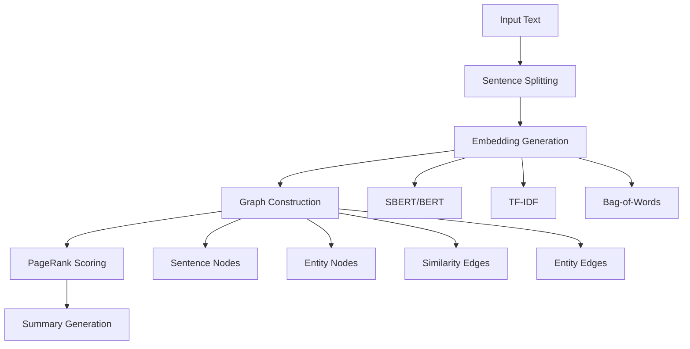

# GitHub Repository Setup

Great idea! Let's create a professional GitHub repository to showcase your internship work. This will be excellent for your resume and future internship applications.

## Repository Name Suggestions:
1. `graph-based-text-summarization`
2. `pagerank-text-summarizer`
3. `nlp-graph-summarization`
4. `extractive-summarization-gnn`

I recommend: **`graph-based-text-summarization`**

## README.md Structure:

```markdown
# Graph-Based Text Summarization using PageRank and GNNs

[](https://python.org)
[](LICENSE)
[](https://arxiv.org/abs/2411.xxxxx)

A comprehensive extractive text summarization system that leverages graph algorithms (PageRank) and Graph Neural Networks to generate high-quality summaries from long documents.

## 🚀 Features

- **Multiple Embedding Methods**: SBERT, BERT, TF-IDF, and Bag-of-Words
- **Advanced Graph Construction**: Sentence-sentence, sentence-entity, and entity-entity relationships
- **Diversity-Focused PageRank**: Novel algorithm balancing similarity and diversity
- **Hyperparameter Optimization**: Comprehensive tuning of similarity thresholds and edge weights
- **Extensive Evaluation**: ROUGE metrics with ablation studies and statistical analysis
- **Interactive Visualization**: Real-time graph visualization during summarization

## 📊 Performance Highlights

| Metric | Best Score | Configuration |
|--------|------------|---------------|
| ROUGE L2-Norm | **0.4774** | SBERT + Diversity PageRank (0.8) |
| ROUGE-1 | 0.3253 | Optimal similarity threshold |
| ROUGE-2 | 0.1136 | Balanced edge weighting |
| Processing Speed | ~1000 articles/100s | Efficient graph processing |

## 🏗️ Architecture


```mermaid
graph TB
    A[Input Text] --> B[Sentence Splitting]
    B --> C[Embedding Generation]
    C --> D[Graph Construction]
    D --> E[PageRank Scoring]
    E --> F[Summary Generation]
    
    C --> C1[SBERT/BERT]
    C --> C2[TF-IDF]
    C --> C3[Bag-of-Words]
    
    D --> D1[Sentence Nodes]
    D --> D2[Entity Nodes]
    D --> D3[Similarity Edges]
    D --> D4[Entity Edges]
```

## 🛠️ Installation

```bash
# Clone repository
git clone https://github.com/yourusername/graph-based-text-summarization.git
cd graph-based-text-summarization

# Install dependencies
pip install -r requirements.txt

# Download spaCy model
python -m spacy download en_core_web_sm

# Pre-train TF-IDF and BoW models
python pretrain_bow_tfidf.py
```

## 📁 Project Structure

```
graph-based-text-summarization/
├── src/
│   ├── summarizer.py          # Main summarization pipeline
│   ├── sent_embd.py          # Sentence embedding strategies
│   ├── reactive_graph.py     # Graph model with visualization
│   ├── rank.py              # PageRank and diversity algorithms
│   └── evaluator.py         # Evaluation and metrics
├── experiments/
│   ├── hyperparameter_tuning.py
│   ├── ablation_study.py
│   └── diversity_analysis.py
├── models/                   # Pre-trained models
├── data/                    # Dataset handling
├── results/                 # Evaluation results
└── notebooks/              # Jupyter notebooks for analysis
```

## 🚦 Quick Start

```python
from src.summarizer import summarize_text

# Basic usage
text = "Your long document text here..."
summary = summarize_text(text, k=3, embedder_kind="sbert")
print("Summary:", summary)

# Advanced usage with customization
summary = summarize_text(
    text, 
    k=3,
    sim_threshold=0.8,
    embedder_kind="sbert",
    diversity_strength=0.8,
    enable_visualization=True
)
```

## 📈 Key Findings

### Optimal Parameters:
- **Similarity Threshold**: 0.8
- **Diversity Strength**: 0.8
- **Embedder**: SBERT
- **Summary Length**: 3 sentences

### Research Insights:
1. **Diversity improves performance**: 0.8 diversity strength outperforms traditional PageRank
2. **Higher similarity thresholds work better**: 0.8 threshold beats lower values
3. **Entity relationships add value**: But require careful weighting
4. **SBERT outperforms traditional methods**: But TF-IDF remains competitive for speed

## 🧪 Experiments

### Hyperparameter Tuning


### Ablation Study


### Diversity Analysis


## 📚 Datasets

- **CNN/DailyMail**: 300K news articles with highlights
- **ArXiv**: Scientific papers with abstracts
- Custom preprocessing and validation splits

## 🤝 Contributing

We welcome contributions! Please see our [Contributing Guidelines](CONTRIBUTING.md) for details.

## 📄 License

This project is licensed under the MIT License - see the [LICENSE](LICENSE) file for details.

## 📞 Contact

**Mahmoud El-Bahnasawi**  
- Email: mahmoud.elbahnasawi@zewailcity.edu.eg  
- LinkedIn: [Your LinkedIn Profile]  
- arXiv: [Your Paper Link]

## 🙏 Acknowledgments

- **Dr. Doaa Shawky** - Project supervision
- **Zewail City of Science and Technology** - Research environment
- **Open-source community** - Libraries and tools