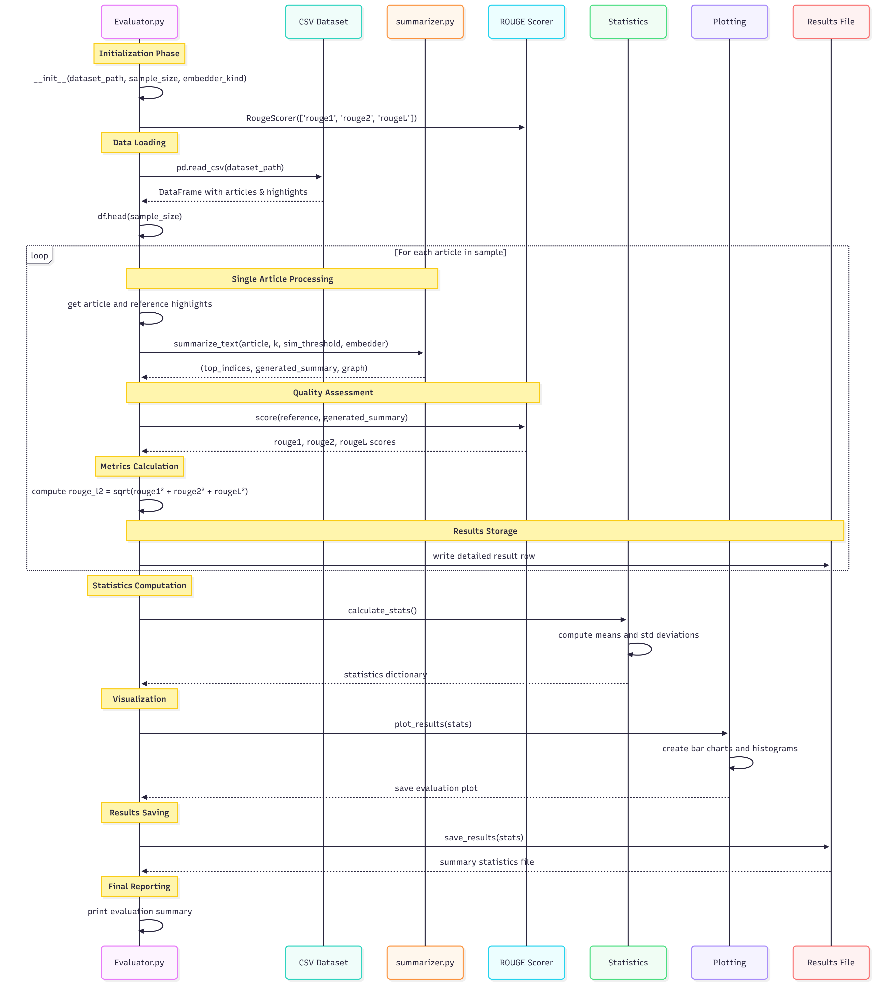

# 🧠 Graph-Based Text Summarization Framework

A modular and interpretable **graph-based extractive summarization** system that combines **semantic embeddings (SBERT)** with **graph ranking** to identify the most informative sentences.  
It supports multiple embedders (SBERT, TF-IDF, BoW), integrates entity-level relationships, and includes built-in evaluation via **ROUGE metrics**.

---

## 🚀 Quick Start

```bash
# Clone the repository
git clone https://github.com/El-Bahnasawi/Graph-Based-Text-Summarization.git
cd Graph-Based-Text-Summarization

# Install dependencies
pip install -r requirements.txt

# Run summarization
python src/summarizer.py

# Run evaluation
python experiments/ablation_study.py
````

---

## 📂 Directory Overview

| Folder / File          | Description                                                            |
| ---------------------- | ---------------------------------------------------------------------- |
| `src/`                 | Core modules (text processing, embedding, graph construction, ranking) |
| `experiments/`         | Experimental scripts (ablation studies, evaluation runs)               |
| `datasets/`            | Input datasets for summarization and evaluation                        |
| `Results/`             | Generated metrics, plots, and logs                                     |
| `diagrams/`            | UML and sequence diagrams for pipeline visualization                   |
| `streamlit_app.py`     | Interactive summarization interface                                    |
| `readme_builder.ipynb` | Notebook used to auto-generate README sections                         |
| `LICENSE`              | MIT License                                                            |
| `README.md`            | Project documentation                                                  |

---

## 🧩 System Architecture

The summarization pipeline follows a five-step process:

### 1️⃣ Text Processing

* Sentences are split and named entities extracted using `TextProcessor`.
* Each sentence and its entities are mapped for embedding.

### 2️⃣ Sentence Embedding

* `EmbeddingService` computes embeddings via SBERT, TF-IDF, or BoW.
* Similarity matrices are generated for graph construction.

### 3️⃣ Graph Construction

* Nodes represent sentences and entities.
* Edges capture sentence-sentence, sentence-entity, and entity-entity relationships.
* The `GraphBuilder` module handles connectivity.

### 4️⃣ Graph Ranking

* The `Rank.py` module implements PageRank with damping and power iteration.
* Sentences are ranked based on graph centrality.

### 5️⃣ Result Extraction

* Top-ranked sentences form the final summary.
* Results include top indices, sentences, and similarity graphs.

---

### 📈 Sequence Diagram — Summarization Flow

<p align="center">
  <br>
  <em>End-to-end summarization pipeline — from preprocessing to sentence extraction.</em>
</p>

### 📉 Sequence Diagram — Evaluation Flow

<p align="center">
  <br>
  <em>Evaluation process showing interaction between evaluator, dataset, and ROUGE scorer.</em>
</p>

### 🧱 Class Diagrams

<p align="center">
  <br>
  <em>Summarization class structure.</em>
</p>

<p align="center">
  <br>
  <em>Evaluation and result storage class structure.</em>
</p>

---

## 🧪 Experimental Results

### 1️⃣ Hyperparameter Tuning — *Similarity Threshold vs ROUGE L2-Norm*

To identify the optimal similarity threshold, we performed a systematic sweep (0.1–0.9) for each embedder: **SBERT**, **TF-IDF**, and **BoW**.

<p align="center">
  
</p>

| Embedder   | Optimal Threshold | ROUGE L2-Norm | Trend                                   |
| ---------- | ----------------: | ------------: | --------------------------------------- |
| **SBERT**  |           **0.3** |     **0.384** | Peaks early; gradual decline beyond 0.5 |
| **TF-IDF** |               0.1 |         0.353 | Steep decay beyond 0.2                  |
| **BoW**    |               0.1 |         0.370 | Moderate stability; lower ceiling       |

**Observations**

* **SBERT** leads in stability and performance, benefiting from semantic embeddings.
* **TF-IDF** and **BoW** degrade faster with higher thresholds, showing limited adaptability.
* The effective threshold range is **0.1–0.3**, balancing noise filtering and coverage.

---

### 2️⃣ Ablation Study — *Component Contribution Analysis*

We measured the contribution of each graph component by removing specific edge types (sentence–sentence, sentence–name, name–name).

<p align="center">
  
</p>

#### ROUGE Scores Across Configurations

| Configuration                  |   ROUGE-1 |   ROUGE-2 |   ROUGE-L | ROUGE L2-Norm | Avg Time (s) |
| ------------------------------ | --------: | --------: | --------: | ------------: | -----------: |
| **Full Model (SBERT)**         |     0.312 |     0.105 |     0.187 |         0.384 |     **0.09** |
| **No Sentence–Sentence Edges** |     0.262 |     0.074 |     0.160 |         0.320 |         0.04 |
| **No Sentence–Name Edges**     |     0.333 |     0.116 |     0.203 |         0.410 |         0.03 |
| **No Name–Name Edges**         |     0.325 |     0.113 |     0.199 |         0.398 |         0.02 |
| **Only Sentence–Sentence**     | **0.330** | **0.116** | **0.203** |     **0.410** |         0.03 |
| **TF-IDF Baseline**            |     0.286 |     0.094 |     0.177 |         0.353 |         0.02 |
| **BoW Baseline**               |     0.301 |     0.100 |     0.182 |         0.370 |         0.02 |
| **Only Name Relationships**    |     0.248 |     0.070 |     0.157 |         0.319 |         0.04 |

---

#### Component Importance (Δ ROUGE L2-Norm)

| Ablated Component           | Δ Performance | Significance |
| --------------------------- | ------------: | ------------ |
| **Sentence–Sentence Edges** |    **−0.067** | High         |
| **Sentence–Name Edges**     |        +0.022 | Low          |
| **Name–Name Edges**         |        +0.014 | Low          |

**Interpretation**

* **Sentence–Sentence edges** form the **semantic backbone** of the graph.
* Entity edges provide **contextual enrichment** with marginal quantitative gain.
* The “Only Sentence–Sentence” setup slightly **outperforms** the full model, implying redundancy when entity-based edges coexist with dense sentence connectivity.

---

#### Processing Time Trade-offs

| Configuration          | Avg Time (s) | Relative to Full Model |
| ---------------------- | -----------: | ---------------------: |
| **Full Model (SBERT)** |         0.09 |                  1.00× |
| **Ablated Variants**   |    0.02–0.04 |         ~0.4× speed-up |

Lightweight graphs significantly **reduce runtime** with minimal loss in summarization quality — an encouraging sign for scalability.

---

### 3️⃣ Summary of Findings

| Metric                      | Finding                                         |
| --------------------------- | ----------------------------------------------- |
| **Best Configuration**      | *Only Sentence–Sentence* (ROUGE L2-Norm ≈ 0.41) |
| **Worst Configuration**     | *No Sentence–Sentence* (ROUGE L2-Norm ≈ 0.32)   |
| **Most Critical Component** | Sentence–Sentence edges                         |
| **Average Processing Time** | 0.042 s per article                             |
| **Overall Success Rate**    | 100% (1,000–6,000 samples per setting)          |

---

### 4️⃣ Practical Insights

* **Semantic connectivity dominates** — removing it collapses coherence and recall.
* **Entity linking is expendable** for small-scale summarization but valuable in domain-specific contexts (e.g., biomedical or news summarization).
* **SBERT embeddings** offer the best compromise between quality and interpretability.
* The **graph-based architecture** remains robust, with ablated variants maintaining competitive ROUGE scores.

---

*Example graph visualization showing inter-sentence relationships via cosine similarity.*

---

## 📜 License

This project is licensed under the MIT License — see the [LICENSE](LICENSE) file for details.

---

## 🙏 Acknowledgments

* **Collaboration**: Amr Ashraf
* **Supervision**: Dr. Doaa Shawky
* **Institution**: Zewail City of Science and Technology
* **Community**: Open-source contributors and tool developers

---

## 🧩 Citation

If you use this work in your research or project, please cite it as:

```bibtex
@software{bahnasawi2025graphsum,
  author = {Mahmoud El-Bahnasawi and Amr Ashraf},
  title = {Graph-Based Text Summarization Framework},
  year = {2025},
  institution = {Zewail City of Science and Technology},
  license = {MIT}
}
